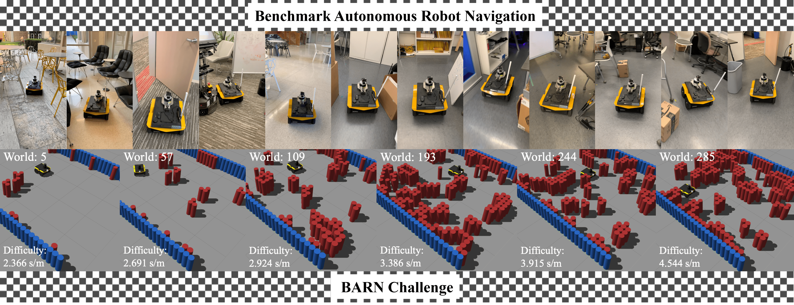

<p align="center">
  
</p>

--------------------------------------------------------------------------------

# DRL-VO control policy for ICRA 2022 BARN Challenge

Our DRL-VO control policy ranked 1st in the simulated competition and 3rd in the final physical competition of the ICRA 2022 BARN Challenge.
Implementation details can be found in our paper ["DRL-VO: Learning to Navigate Through Crowded Dynamic Scenes Using Velocity Obstacles"](https://doi.org/10.1109/TRO.2023.3257549
)([arXiv](https://arxiv.org/pdf/2301.06512.pdf)) in IEEE Transactions on Robotics (T-RO) 2023. 
Video demos can be found at [multimedia demonstrations](https://www.youtube.com/watch?v=KneELRT8GzU&list=PLouWbAcP4zIvPgaARrV223lf2eiSR-eSS&index=2&ab_channel=PhilipDames).

The details of BARN Challenge can be found in our paper ["Autonomous Ground Navigation in Highly Constrained Spaces: Lessons Learned From the Benchmark Autonomous Robot Navigation Challenge at ICRA 2022 [Competitions]"](https://ieeexplore.ieee.org/stamp/stamp.jsp?arnumber=9975161)

* navigation metric: 0.2339

## Requirements:
* Ubuntu 20.04/18.04
* ROS-Noetic/ROS Melodic
* Python 3.7
* Singularity 

## Usage:
First download pre-created ["nav_competition_image.sif"](https://doi.org/10.5281/zenodo.7968623) container to the home directory.
### Simulation:
```
# clone this project:
git clone -b hardware https://github.com/TempleRAIL/nav-competition-icra2022-drl-vo.git
cd nav-competition-icra2022-drl-vo

# move nav_competition_image.sif container to current directory:
mv ~/nav_competition_image.sif ./

# single world test:
./singularity_run.sh ./nav_competition_image.sif python run.py --out ~/drl_vo_out.txt

# 50 worlds test: 1 trial
./singularity_run.sh ./nav_competition_image.sif python run_drl_vo.py --out ~/drl_vo_out.txt --trials 1

# 50 worlds test: 10 trial
./singularity_run.sh ./nav_competition_image.sif python run_drl_vo.py --out ~/drl_vo_out.txt --trials 10

# report results:
./singularity_run.sh ./nav_competition_image.sif python report_test.py --out_path ~/drl_vo_out.txt
```
### Hardware:
```
# enter the directory of nav_competition_image.sif container and run the container: home directory
cd ~
singularity shell --nv nav_competition_image.sif
source /etc/.bashrc

# set the appropriate goal point and run the DRL-VO policy: the robot's initial local coordinate system when the robot is powered on (right hand rule)
roslaunch jackal_helper move_base_drl_vo.launch goal_x:="20" goal_y:="15"
```
### Modify code in hardware:
```
# enter the directory of nav_competition_image.sif container and run the container:
cd ~
singularity shell --nv nav_competition_image.sif
source /etc/.bashrc

# create ros workspace and clone this project:
mkdir -p jackal_ws/src
cd jackal_ws/src
git clone -b hardware https://github.com/TempleRAIL/nav-competition-icra2022-drl-vo.git

# modify the corresponding code as needed

# compile:
cd ..
catkin_make
source devel/setup.sh

# set the appropriate goal point and run the DRL-VO policy: the robot's initial local coordinate system when the robot is powered on (right hand rule)
roslaunch jackal_helper move_base_drl_vo.launch goal_x:="20" goal_y:="15"
```
--------------------------------------------------------------------------------
## Citation
```
@article{xie2023drl,
  author={Xie, Zhanteng and Dames, Philip},
  journal={IEEE Transactions on Robotics}, 
  title={DRL-VO: Learning to Navigate Through Crowded Dynamic Scenes Using Velocity Obstacles}, 
  year={2023},
  volume={39},
  number={4},
  pages={2700-2719},
  doi={10.1109/TRO.2023.3257549}
}

@article{xiao2022autonomous,
  title={Autonomous Ground Navigation in Highly Constrained Spaces: Lessons Learned From the Benchmark Autonomous Robot Navigation Challenge at ICRA 2022 [Competitions]},
  author={Xiao, Xuesu and Xu, Zifan and Wang, Zizhao and Song, Yunlong and Warnell, Garrett and Stone, Peter and Zhang, Tingnan and Ravi, Shravan and Wang, Gary and Karnan, Haresh and others},
  journal={IEEE Robotics \& Automation Magazine},
  volume={29},
  number={4},
  pages={148--156},
  year={2022},
  publisher={IEEE}
}

```
